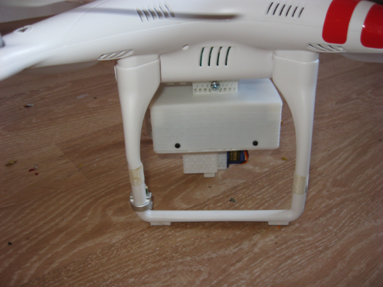
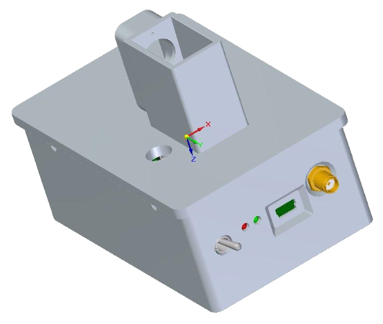

e-mail: git.electroyar@gmail.com | telegram: [@ELEKTRO_YAR](https://t.me/ELEKTRO_YAR) | [github](https://github.com/NewYaroslav)

Санкт-Петербург, предпочитаю удаленную работу.

Разработчик C++ с упором на алгоритмическую торговлю. Имеют опыт работы с микроконтроллерами и встроенными системами, но *данное направление не интересует*.

- C++/C, git, gcc, mingw
- OpenCV, Fann, Eigen, Sqlite, SFML, ImGUI, ODE, и пр.
- MQL4/MQL4
- Web (HTML, JS, CSS)
- Микроконтроллеры (ARM Cortex/STM32/ESP32/NRF52, AVR), RTOS, интерфейсы (UART, SPI, I2C,  и пр.)
- Проектирование схем и печатных плат

# Проекты

### Турель для страйкбола

В 2015 в команде из двух человек разрабатывал систему автоматического наведения страйкбольной турели на движующиеся цели на базе OpenCV.

В 2016 проект продолжил в одиночку. Пробовал сделать алгоритм наведения на цель более универсальным. Придумал [предварительный фильтр объектов](https://github.com/NewYaroslav/ph_object_detector) на изображении, в основе которого используется перцептивный хэш.

### Персональный кондиционер Evapolar

С начала 2016 по сентярь 2017 участвовал в разработке прошивки для первой версии персонального кондиционера Evapolar.

### Персональный кондиционер evaSmart

В 2017 работал над прошивкой умного персонального кондиционера Evapolar.

### Алгоритмический трейдинг

С сентября 2017 по февраль 2018 работал над собственным проектом робота для автоматчиеской торговли. Проводил исследования рычноных закономерностей. В дальнейшем из-за нехватки средств проект пришлось отложить.

### Бот для LocalBitcoins

С февраля по сентябрь 2018 занимался разработкой бота для LocalBitcoins в команде инвестора. 

### Модуль для дронов

C сентября 2018 по март 2019 работал над созданием модуля для дронов в команде инвестора. Модуль должен был отпускать полезную нагрузку дрона в момент пролета над целью. Модуль должен был учитывать направление и скорость ветра, высоту, скорость и направление полета дрона, высоту над уровнем моря, параметры сбрасываемого груза. Устройство необходимо было разработать с нуля в условиях очень низкого бюджета, а также создать приложение для смартфона. 

Предварительно все алгоритмы модуля были проверены в симуляторе на базе движка ODE. Проект был доведен до рабочего прототипа. Удалось добиться среднего радиуса попадания полезной нагрузки в 3 метра на октрытом пространстве.

### Счетчик патронов

С марта по сентябрь 2019 работал над созданием счетчика патронов в команде инвестора. Проект вел в одинчоку с очень низким бюджетом. Необходимо было разработать устройство с нуля, а также создать приложение для смартфона. Устройство могло работать с любым пистолетом со свободной рамой и определять выстрелы и осчечки, замерять время между выстрелами и передавать данные в приложение для сбора статистики. Проект был доведен до рабочего прототипа.

### Алгоритмический трейдинг 2.0

С сентября 2019 по август 2022 работал в свобственном проекте по алгоритмической торговле.
