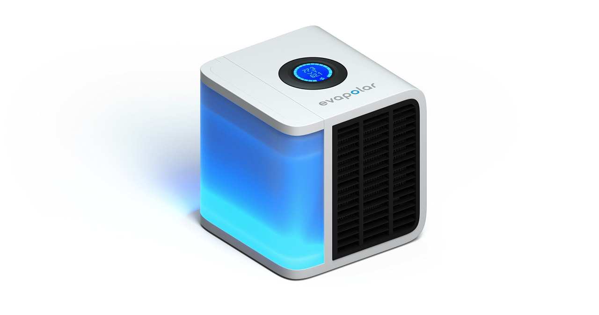
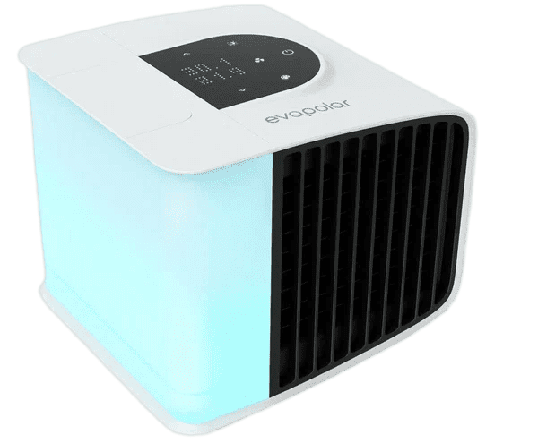

Программист-алготрейдер.

## Турель для страйкбола

В 2015 разрабатывал систему автоматического наведения страйкбольной турели на движующиеся цели на базе OpenCV.

## Персональный кондиционер Evapolar

С начала 2016 по сентярь 2017 участвовал в разработке прошивки для первой версии персонального кондиционера Evapolar.

## Персональный кондиционер evaSmart

В 2017 работал над прошивкой умного персонального кондиционера Evapolar.

## Счетчик патронов

С марта по сентябрь 2019 работал над созданием счетчика патронов в команде инвестора. Проект вел в одинчоку с очень низким бюджетом. Необходимо было разработать устройство с нуля, а также создать приложение для смартфона. Устройство могло работать с любым пистолетом со свободной рамой и определять выстрелы и осчечки, замерять время между выстрелами и передавать данные в приложение для сбора статистики.

